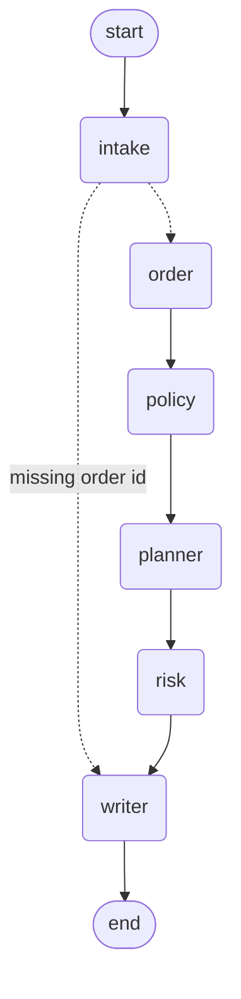

# Architecture

PolicyDesk is a single LangGraph `StateGraph` coordinating six small agents over a
shared `SupportState`. Reasoning is decoupled from plumbing by a `Reasoner` seam,
and every side-effecting action goes through a deterministic, sanitized tool.

## Graph

Two routes:
- **ask branch** — `intake → writer` when an order id is required but missing.
- **resolve branch** — `intake → order → policy → planner → risk → writer`.

## Nodes (`app/agents/`)

| Node | Responsibility | Tools it may call |
| --- | --- | --- |
| `intake` | Extract intent, entities (`order_id`), urgency, missing info | — |
| `order` | Read the fake order DB; pull payment history for double-charges | `lookup_order`, `check_payment_history` |
| `policy` | Ground the case in local policy docs | `search_policies` |
| `planner` | Choose `next_action` (answer/ask/refund/replacement/escalate) | — |
| `risk` | Guardrail: set `risk_level`, gate high-value refunds | `request_human_approval` |
| `writer` | Compose the reply; execute the approved action | `issue_refund`, `create_ticket` |

The **node — not the model — decides which tools fire.** This is the key design
choice: it keeps the trajectory exact and testable regardless of the reasoning
backend.

## The `Reasoner` seam (`app/reasoner.py`)

`get_reasoner()` returns one of:
- `StubReasoner` (default, `POLICYDESK_LLM=stub`) — rule-based intent classification,
  action selection, and templated grounded responses. Offline, zero tokens, fully
  reproducible.
- `ClaudeReasoner` (`POLICYDESK_LLM=claude`) — `ChatAnthropic(model="claude-opus-4-8")`
  with `.with_structured_output` for intake/planning. Imported lazily so the default
  path never needs `langchain-anthropic`.

Both implement the same three methods (`extract_intake`, `decide_action`,
`write_response`), so swapping backends changes wording and classification — never
tool selection or routing.

## State (`app/state.py`)

`SupportState` is a `TypedDict`. `tool_calls` and `route` use additive reducers, so
the trajectory accumulates as the graph runs — that accumulated trajectory is exactly
what the eval harness inspects.

## Guardrails

- Refunds over **$100**, plus account/identity changes, require human approval. `risk`
  records `request_human_approval` and `writer` refuses to call `issue_refund` while
  `approval_required` is true and `approved` is false.
- `--approve` (CLI) re-runs with `approved=True` to simulate the human granting
  approval; the refund then executes.
- Sensitive intents (privacy requests, identity, prompt injection) are marked high risk
  and never trigger irreversible actions.
